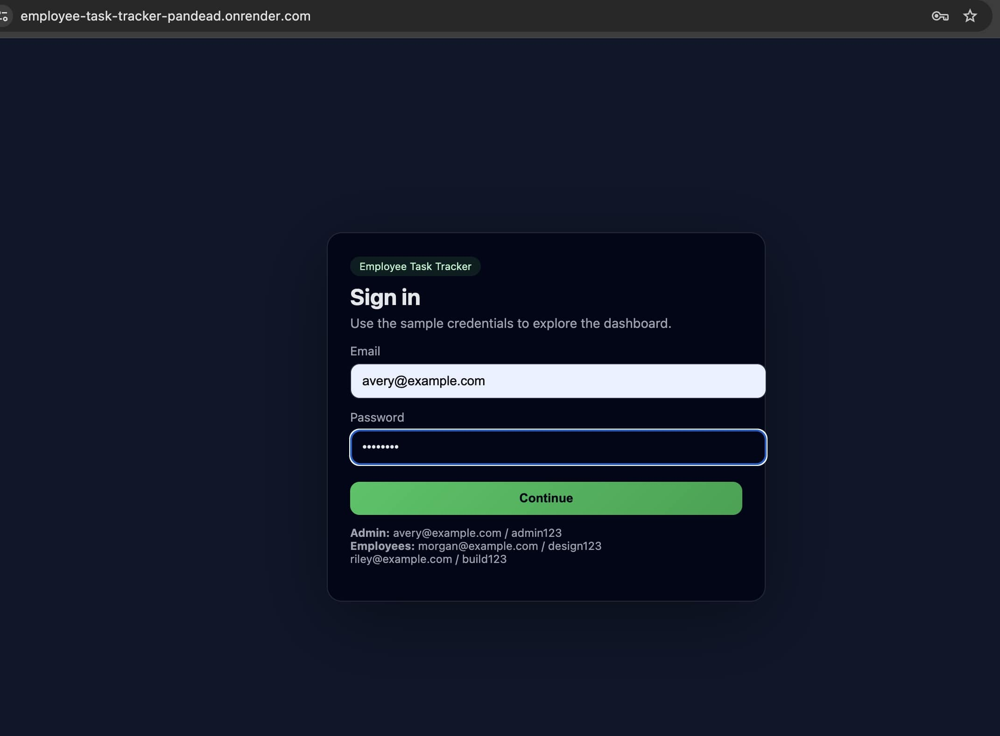
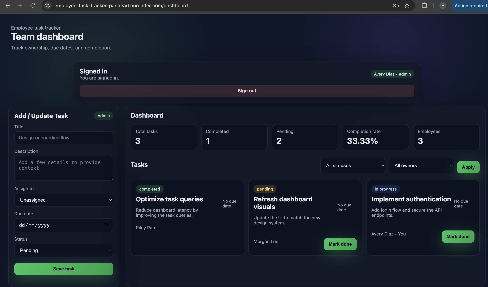

# **Employee Task Tracker**

A simple full-stack task management system with authentication, roles, and a clean dashboard-ui.  
Frontend is plain HTML/JS. Backend is done using Flask + SQLite.

**Live Demo:**  
https://employee-task-tracker-pandead.onrender.com

---

# **Overview**

Admin and employees log in to view and manage tasks.  
Admins can create, assign, and update all tasks.  
Employees can only view and complete their own tasks.

All data is stored in SQLite and persists across restarts.

---
# **Tech Stack**

## **Backend**
- Python  
- Flask  
- Flask-SQLAlchemy  
- SQLite  

## **Frontend**
- HTML  
- Minimal CSS  
- JavaScript (Fetch API)

## **Deployment**
- Render Web Service  
- SQLite stored on Render disk  

---
# **Local Setup**

- Clone the repository
  
- Create a virtual environment and activate it
- Install the dependencies 
- Run the app
---

# **Screenshots**

## **Login Page**

## **Dashboard**

